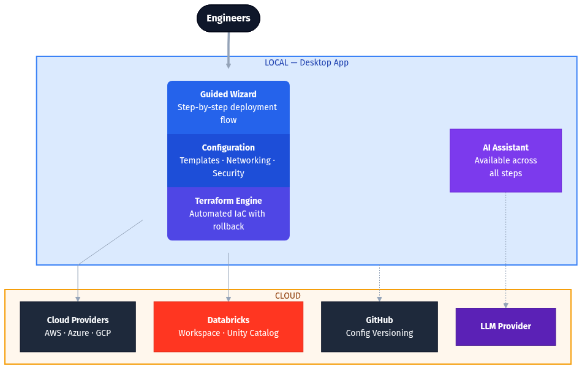

# Databricks Deployer

Desktop app for deploying Databricks workspaces on AWS, Azure, and GCP using Terraform.

**Download:** See [GitHub Releases](https://github.com/OgnjenPantelic/workspace-creator/releases) for the latest builds.

## Features

### Deployment
- Guided deployment wizard for AWS, Azure, and GCP
- Template-based deployments with per-cloud template selection
- Unity Catalog metastore auto-detection and assignment
- Catalog creation with isolated storage (S3 / Azure Storage / GCS)
- Real-time resource timeline during deployment
- Rollback support (terraform destroy with resource cleanup)
- Auto-import and retry when Terraform hits "resource already exists" errors — automatically runs `terraform import` and retries `apply` (up to 3 rounds) for Azure resources, Databricks Private Endpoint rules, and network connectivity configs
- Resource name conflict detection for Azure — warns before deployment if resource groups already exist

### Authentication
- Supports CLI profiles, SSO, and service principal authentication
- Browser-based login flows for Azure CLI, GCP ADC, and AWS SSO with cancel support
- Azure identity for Databricks (no service principal needed with Azure CLI + Account Admin)
- GCP service account creation with custom IAM role and impersonation setup
- Cloud-specific permission validation before deployment

### Networking & Proxy
- VNet injection (Azure) / BYOVPC (AWS) / Customer-managed VPC (GCP)
- Connectivity check for Terraform registries with corporate proxy detection
- System proxy auto-detection (macOS/Windows) injected into Terraform and HTTP requests

### Integrations
- Git integration with `terraform.tfvars.example` generation, GitHub OAuth device flow, repo creation, and push
- AI Assistant with contextual help for each screen (GitHub Models free, OpenAI, Claude) — see [docs/ai-assistant.md](docs/ai-assistant.md)

### General
- Auto-installs Terraform if missing (v1.9.8)
- GCP project dropdown auto-populated from authenticated account
- Settings menu on welcome screen (open deployments folder)
- Single-instance enforcement (prevents running multiple copies)

## Quick Start

1. Download from [Releases](https://github.com/OgnjenPantelic/workspace-creator/releases) or [build from source](#build--run)
2. Select cloud provider (AWS, Azure, or GCP)
3. Verify dependencies (Terraform, Git, cloud CLIs)
4. Enter cloud credentials (CLI profile, service principal, or ADC)
5. Enter Databricks credentials (profile, service principal, or Azure identity)
6. Select deployment template
7. Configure workspace (name, region, networking)
8. Configure Unity Catalog (optional — auto-detects existing metastore)
9. Review and deploy

## Prerequisites

| Requirement | Status | Notes |
|-------------|--------|-------|
| Git | Required | For Terraform module downloads |
| Terraform | Required | Auto-installed if missing (v1.9.8) |
| Databricks CLI | Optional | Enables profile-based auth |
| AWS CLI | Optional | For AWS deployments, SSO supported |
| Azure CLI | Optional | For Azure deployments |
| Google Cloud CLI | Optional | For GCP deployments (ADC and impersonation) |

## Templates

| ID | Name | Cloud | Description |
|----|------|-------|-------------|
| `aws-simple` | AWS Standard BYOVPC | AWS | Standard workspace with customer-managed VPC ([README](src-tauri/templates/aws-simple/README.md)) |
| `aws-sra` | AWS Security Reference Architecture | AWS | Enterprise-grade security with PrivateLink, CMK encryption, and compliance controls |
| `azure-simple` | Azure Standard VNet | Azure | Standard workspace with VNet injection ([README](src-tauri/templates/azure-simple/README.md)) |
| `azure-sra` | Azure Security Reference Architecture | Azure | Enterprise-grade hub-spoke deployment with Private Endpoints and CMK encryption |
| `gcp-simple` | GCP Standard BYOVPC | GCP | Standard workspace with customer-managed VPC ([README](src-tauri/templates/gcp-simple/README.md)) |
| `gcp-sra` | GCP Security Reference Architecture | GCP | Enterprise-grade security with Private Service Connect, CMEK, and hardened firewall ([README](src-tauri/templates/gcp-sra/readme.md)) |

Each template creates Unity Catalog metastore/catalog, workspace, networking, and required cloud resources.

## Authentication

### Databricks
**Option 1: CLI Profile** (recommended)
```bash
databricks auth login --account-id <ACCOUNT_ID>
```

**Option 2: Service Principal** — Account ID, Client ID, Client Secret

**Azure users:** Can use Azure identity if authenticated via Azure CLI and have Account Admin role (see Azure section below).

### AWS
- CLI profiles (`~/.aws/credentials`) including SSO
- Or manual: Access Key ID, Secret Access Key
- Required IAM permissions: EC2, VPC, S3, IAM, STS (for cross-account roles)

### Azure
- CLI auth (`az login`)
- Or service principal: Tenant ID, Subscription ID, Client ID, Client Secret

**Option 3: Azure Identity (Azure CLI only)**
- Requires Azure CLI (`az login`) and Databricks Account Admin privileges
- Uses Azure AD token directly (no Databricks service principal needed)
- Terraform auth type: `azure-cli`

### GCP
**Option 1: ADC with Service Account Impersonation** (recommended)
```bash
gcloud auth application-default login
```
The app can create a service account with a custom IAM role and configure impersonation automatically.

**Option 2: Service Account Key** — paste a JSON key file. Required GCP permissions: Compute, Service Networking, IAM, Service Account Admin, Storage.

## AI Assistant

The app includes an embedded AI assistant with context-aware help for each screen. See [docs/ai-assistant.md](docs/ai-assistant.md) for full setup instructions.

| Provider | Cost | Notes |
|----------|------|-------|
| GitHub Models | Free | Recommended. Requires GitHub PAT with `models:read` permission |
| OpenAI | Paid | Requires OpenAI API key |
| Claude | Paid | Requires Anthropic API key |

Setup: click the chat icon (bottom-right) → select a provider → click "Get API Key" → paste your key → "Connect".

## Deployment Storage

| OS | Path |
|----|------|
| macOS | `~/Library/Application Support/com.databricks.deployer/deployments/` |
| Windows | `%APPDATA%\com.databricks.deployer\deployments\` |
| Linux | `~/.local/share/com.databricks.deployer/deployments/` |

## Security

- API keys and credentials are encrypted at rest using AES-256-GCM
- Cloud credentials are never persisted — they are passed to Terraform via environment variables per-run
- AI Assistant sends data directly to the chosen provider; nothing is proxied through third-party servers
- Single-instance enforcement prevents credential exposure from parallel app sessions

## Configuration

There is no `.env` file. All runtime configuration is managed through Tauri's app data directory (see Deployment Storage above). The only external environment variable is `HTTPS_PROXY` — set it before launching the app if you need to override the auto-detected system proxy.

## Troubleshooting

### Terraform not found after install
Restart the app. Terraform is installed to `~/.databricks-deployer/bin/`.

### Connectivity check warns about unreachable domains
Terraform needs access to `registry.terraform.io`, `releases.hashicorp.com`, and `github.com`. If you're behind a corporate proxy, ensure your system proxy is configured — the app auto-detects macOS/Windows proxy settings and injects them into Terraform. If issues persist, set `HTTPS_PROXY` before launching the app.

### Deployment stuck
Check the logs in the deployment folder. You can run `terraform apply` manually from there.

### Databricks token cache issues
Delete `~/.databricks/token-cache.json` and re-run `databricks auth login`.

For cloud CLI issues, GCP-specific errors, Unity Catalog permissions, and AI Assistant troubleshooting, see [docs/troubleshooting.md](docs/troubleshooting.md).

---

## Architecture



The app is built with [Tauri 2](https://v2.tauri.app/) — a React/TypeScript frontend communicates with a Rust backend via Tauri's `invoke` IPC mechanism. The Rust backend shells out to the Terraform CLI for all infrastructure operations and handles credential validation, encryption, and cloud API calls. Terraform templates (`.tf` files in `src-tauri/templates/`) are bundled into the app binary via Tauri's resource system. On first launch — or when `TEMPLATES_VERSION` in `src-tauri/src/commands/mod.rs` changes — the backend extracts them to the app data directory. The frontend registers 70+ invoke handlers in `src-tauri/src/lib.rs`.

## Build & Run

### Requirements
- Node.js 18+
- Rust 1.70+ (install via [rustup](https://rustup.rs/))
- Tauri CLI (`cargo install tauri-cli` or use `npx @tauri-apps/cli`)
- Platform build tools (Xcode on macOS, Visual Studio on Windows)

### Commands
```bash
git clone https://github.com/OgnjenPantelic/workspace-creator.git
cd workspace-creator/desktop-app
npm install
npm run tauri dev      # Full app with Rust backend
```

Other commands:
```bash
npm run dev            # Frontend only (Vite dev server)
npm run build          # Build frontend
npm run tauri build    # Production build
```

Output: `src-tauri/target/release/bundle/` (macOS: `.dmg`, Windows: `.msi`/`.exe`)

## Development

### Running Tests
```bash
# Frontend (Vitest + React Testing Library)
npm run test           # Watch mode
npm run test:run       # Single run
npm run test:coverage  # Coverage report

# Backend (Rust)
cd src-tauri && cargo test
```

Frontend tests use Vitest with React Testing Library. Tauri commands are automatically mocked in `src/test/setup.ts`. Backend tests use inline `#[cfg(test)]` modules covering validation, encryption, Terraform parsing, env var building, and template integration.

### Code Quality
```bash
npm run build          # TypeScript compilation check
```

### CI

Pull requests targeting `main` run the `ci.yml` GitHub Actions workflow: TypeScript compilation, Vitest suite, `cargo check`, and `cargo test`.

### Adding Features
- Template changes require incrementing `TEMPLATES_VERSION` in `src-tauri/src/commands/mod.rs`
- Variable display names go in `src/constants/templates.ts`
- See `.cursor/rules/` for project conventions

### Adding Templates

**Backend (Rust + Terraform):**
1. Create `src-tauri/templates/{cloud}-{name}/` with Terraform files (`variables.tf` required)
2. Register in `src-tauri/src/commands/templates.rs` → `get_templates()`

**Frontend (TypeScript):**
3. Add variable display names to `VARIABLE_DISPLAY_NAMES` in `src/constants/templates.ts`
4. Add variable descriptions to `VARIABLE_DESCRIPTION_OVERRIDES` in `src/constants/templates.ts`
5. Add credential/internal variables to `EXCLUDE_VARIABLES` or `INTERNAL_VARIABLES` in `src/constants/templates.ts`
6. Add section mappings in `groupVariablesBySection()` in `src/utils/variables.ts`

**Edge cases (if applicable):**
7. If the template's Databricks provider references a workspace URL that doesn't exist during import, add a `workspace_url_override` variable (see `azure-simple` for an example) and handle it in `build_import_env()` in `terraform.rs`

**Finalize:**
8. Increment `TEMPLATES_VERSION` in `src-tauri/src/commands/mod.rs`
9. Rebuild

## Project Structure

```
src/                          # React / TypeScript frontend
  App.tsx, main.tsx, styles.css
  constants/                  # cloud.ts, ui.ts, templates.ts, assistant.ts
  types/                      # cloud.ts, databricks.ts, wizard.ts, assistant.ts, github.ts
  context/
    WizardContext.tsx          # Wizard state management
    AssistantContext.tsx       # AI assistant state with wizard integration
  hooks/
    useAwsAuth.ts             # AWS auth (profiles, SSO, access keys)
    useAzureAuth.ts           # Azure auth (CLI, service principals)
    useGcpAuth.ts             # GCP auth (ADC, impersonation, SA keys)
    useDatabricksAuth.ts      # Databricks account auth
    useDeployment.ts          # Deployment orchestration (init, plan, apply, rollback)
    useUnityCatalog.ts        # Metastore detection and configuration
    useWizard.ts              # Wizard navigation and step management
    useAssistant.ts           # AI assistant chat, auth, model selection
    useGitHub.ts              # Git init, GitHub OAuth, repo creation
    useSsoPolling.ts, usePersistedCollapse.ts
  utils/                      # variables.ts, cloudValidation.ts, databricksValidation.ts, cidr.ts
  components/
    WizardRouter.tsx          # Main wizard routing
    GitIntegrationCard.tsx
    ui/                       # ErrorBoundary, Alert, AuthModeSelector, FormGroup, LoadingSpinner, ...
    screens/                  # Welcome, CloudSelection, Dependencies, TemplateSelection,
                              # Configuration, UnityCatalogConfig, Deployment
      credentials/            # Aws-, Azure-, Gcp-, DatabricksCredentialsScreen
    assistant/                # AssistantPanel, AssistantSetup, AssistantMessage, AssistantSettingsModal
  test/
    setup.ts                  # Vitest global setup (mocks @tauri-apps/api)
    hooks/, utils/            # Unit tests

src-tauri/                    # Rust backend
  src/
    lib.rs                    # Tauri app setup, plugin registration, template extraction
    crypto.rs                 # AES-256-GCM encryption for secrets at rest
    terraform.rs              # Terraform execution, auto-import, retry, output streaming
    dependencies.rs           # CLI detection, version checks, Terraform auto-install
    proxy.rs                  # System proxy detection (macOS / Windows)
    errors.rs                 # Standardized error helpers
    commands/
      mod.rs                  # Shared types, TEMPLATES_VERSION, CLI_LOGIN_PROCESS mutex
      aws.rs, azure.rs, gcp.rs, databricks.rs   # Cloud + Databricks auth commands
      deployment.rs           # Deployment orchestration and tfvars generation
      templates.rs            # Template listing and variable parsing
      github.rs               # Git/GitHub integration commands
      assistant.rs            # AI assistant API integration
  resources/
    assistant-knowledge.md    # Embedded knowledge base for AI assistant
  templates/                  # Terraform templates (aws-simple, aws-sra, azure-simple,
                              # azure-sra, gcp-simple, gcp-sra)
```

## Version Management & Releases

The project uses automated version syncing across `package.json`, `Cargo.toml`, and `tauri.conf.json`.

### Creating a New Release

From the `desktop-app/` directory:

```bash
# Bump version (pick one)
npm version patch --no-git-tag-version   # 1.0.10 → 1.0.11
npm version minor --no-git-tag-version   # 1.0.10 → 1.1.0
npm version major --no-git-tag-version   # 1.0.10 → 2.0.0

# Commit and tag from the repo root
cd ..
git add .
git commit -m "v1.0.11"
git tag v1.0.11
git push --follow-tags
```

The `npm version` command automatically syncs the version to `Cargo.toml` and `tauri.conf.json` via the `version` lifecycle hook.

GitHub Actions will then build macOS (arm64 + x64) and Windows installers and create a GitHub release.

## Contributing

- Branch off `main`, open PRs against `main`
- CI must pass: TypeScript build + Vitest + `cargo check` + `cargo test`
- Run `npm run test:run && cd src-tauri && cargo test` locally before pushing
- Code conventions are documented in `.cursor/rules/desktop-app.md`
- Template changes require a `TEMPLATES_VERSION` bump in `src-tauri/src/commands/mod.rs`
